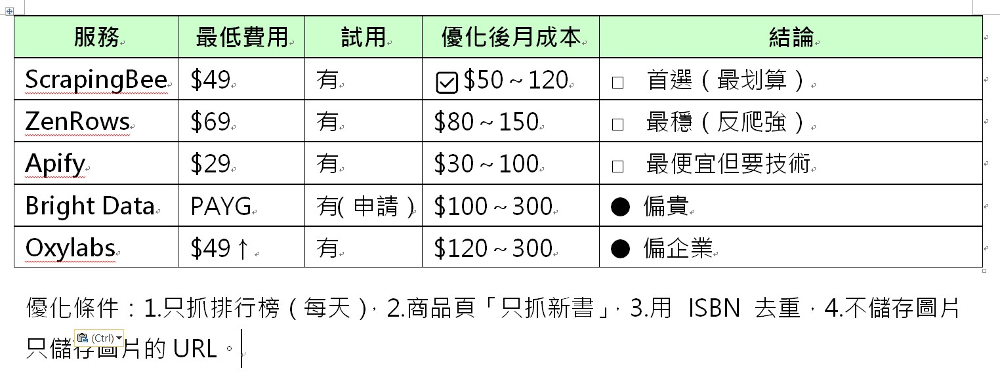
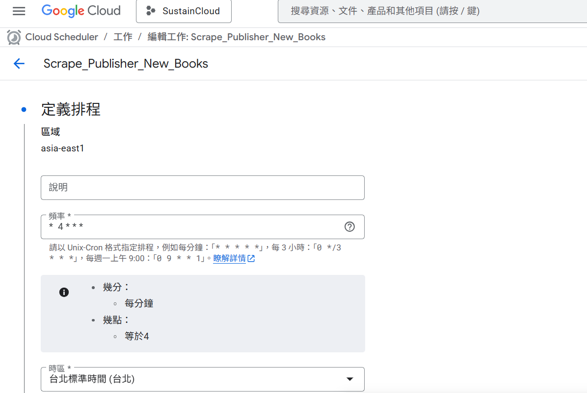

# Books.com.tw Crawler MVP 操作手冊

## 目的

這次 MVP 的目標是讓系統可以查詢 Books.com.tw 出版社新書，並把查到的新書建立成後續任務，交給既有任務排程系統繼續處理。

這次也加入較慢、較分散的請求節奏，目的是降低對 Books.com.tw 的請求壓力，進而降低請求失敗比例。

## 原本評估方向

原本有評估外部爬蟲服務，包含 ScrapingBee、ZenRows、Apify、Bright Data、Oxylabs 等方案。

{ width=65% placement=H }

這些服務是可選方案，但本次 MVP 先採用自有系統處理。原因是目前自處理已可解決主要問題，而外部服務不確定一定能解決 Books.com.tw 的反爬蟲阻擋；若再花時間測試與導入，也可能增加固定費用或用量成本。

## 為什麼這次先採用自有處理方案

實際測試 Books.com.tw 時，系統遇到 Cloudflare anti-bot challenge。簡單說，就是網站判斷請求不像一般使用者瀏覽器，因此可能回傳 challenge page 或 `403 Forbidden`，造成資料抓取失敗。

這次改加入 browser-based crawler，例如 `chromedp`。它的作用是讓後端用接近一般瀏覽器的方式開啟頁面，再取得網頁內容。

`chromedp` 不是另外購買的外部服務，而是放在目前後端系統內執行。本次也讓它可以在 Docker / Cloud Run container 內執行，讓正式環境可以使用同一套方式處理。

這個方向的目的不是增加功能複雜度，而是在不採購外部爬蟲服務的前提下，先用自有系統降低請求失敗比例與額外成本。

## 本次完成項目

- 建立 browser-based 爬取基礎建設：`chromedp` / `playwright-go`。
- 讓 `chromedp` 可以在 Docker / Cloud Run container 內執行。
- 新增出版社新書查詢流程。
- 出版社新書查詢完成後，會建立 tasks，供既有任務排程系統後續使用。
- 出版社新書查詢 API 不需要請求端等待完整流程跑完。
- 降低請求頻率，減少連續請求造成的失敗比例。
- 新增交付用手動測試，確認 Books.com.tw 商品頁爬取能力。

## API 操作方式

Cloud Run 網址：

```text
https://erp-1041060693970.asia-east1.run.app
```

觸發出版社新書查詢：

```bash
curl -X POST "https://erp-1041060693970.asia-east1.run.app/crawler/publishers/new-books"
```

正式環境預期由 GCP Schedule 觸發此 API。每次觸發後，server 會開始跑完整出版社名單。

GCP Schedule 控制的是「多久觸發一次整批流程」，不是控制單一出版社，也不是控制每一家出版社之間的等待時間。每一家出版社之間的等待節奏由系統內部控制，目的是降低請求失敗比例。

## 回應判讀

### 已接收並開始背景處理

若回應為 `202 Accepted`，且內容類似：

```json
{
  "title": "Publisher new books crawling task accepted"
}
```

代表 server 已接收請求，並開始在背景處理出版社新書查詢。請求端不需要等待完整爬取完成。

### 已有任務正在執行

若回應為 `202 Accepted`，且內容類似：

```json
{
  "title": "Publisher new books crawling task already running"
}
```

代表目前已有出版社新書查詢正在執行，不需要重複觸發。等待目前背景任務完成即可。

## 如何確認執行狀態

目前 MVP 版本以 Cloud Run logs 作為主要觀察方式。

可以在 Cloud Run logs 中搜尋：

```text
[crawler][publishers_new_books]
```

常見訊息：

```text
[crawler][publishers_new_books] started
[crawler][publishers_new_books] completed
[crawler][publishers_new_books] failed: ...
[crawler][publishers_new_books] finished elapsed=...
```

其中 `finished elapsed=...` 代表這次背景任務總共花費的時間。

出版社逐筆執行時，也可以觀察：

```text
[EnqueuePublisherNewBookCrawlingTasksUseCase]
```

這類 log 會顯示目前處理到第幾筆出版社、單筆耗時，以及下一筆前的等待時間。

## 手動交付測試

交付測試用來確認 Books.com.tw 商品頁爬取能力。

執行指令：

```bash
go test -tags manual ./internal/infrastructure/books_com_tw -run '^TestScrapeBookURLs_Manual$' -v
```

通過標準：

- 測試內共有 10 筆 Books.com.tw 商品 URL。
- 至少 8 筆成功才算通過。
- 每筆 URL 測試之間會等待 10 秒，避免連續請求造成額外失敗。

## 維護方式

### 調整排程時間

若要改成每天一次、每週一次、暫停或恢復執行，請到 GCP Schedule 調整。

{ width=65% placement=H }

調整前請先確認：一次觸發就是跑完整出版社名單。GCP Schedule 只負責決定多久觸發一次整批流程。

### 調整請求節奏

由工程人員調整 publisher crawling sleep 策略。

目前策略會依出版社總數與 24 小時目標週期動態計算等待時間，越後面的等待時間會逐漸增加，以降低請求失敗比例。

## 後續可加強方向

- 讓長時間執行的工作有正式紀錄，即使服務重新啟動，也能知道是否需要接續或重新執行。
- 新增任務進度查詢 API，讓管理者可以直接看目前執行到哪裡。
- 建立更完整的錯誤報表，方便統計哪些出版社或商品最常失敗。
