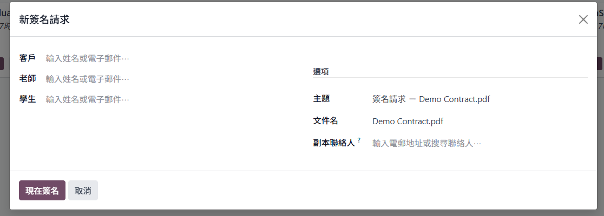

# Odoo Enterprise 操作手冊（簽約、聯絡人、自動帶入、含稅報價、發票、課時管理、線上預約）

> 目的：本手冊專注於 Odoo（Enterprise）後台操作，協助完成你在 temp.md 提到的實際業務需求。內容不涵蓋部署或容器操作。

## 適用前提與啟用的 App

- 版本：Odoo 18（Enterprise）或相容版本。
- 必裝 App：
  - Sign（線上簽署）
  - Sales、Invoicing/Accounting（銷售與發票）
  - Project、Timesheets（專案與工時）
  - Appointments（線上預約）
  - Calendar（行事曆）+ Google Calendar 整合
- 郵件：已設定外寄 SMTP（用於簽約、報價、發票、預約通知）。

---

## 需求對照表

- 簽約：上傳 PDF、寄送給家長/老師線上簽署 → 使用「Sign」。
- CRM：集中管理學生/家長，後續銷售自動帶入 → 使用「Contacts」。
- 報價單（含稅價）：可按月建立，系統自動計稅 → 使用「Sales + Accounting（含稅稅率）」。
- 發票：由報價單/銷售訂單直接開立發票 → 使用「Invoicing/Accounting」。
- 課時管理：預售課程（如 24 堂），每月依授課數結算 → 使用「Project + Timesheets」。
- 線上課程預約：自動產生 Google Meet 並寄信 → 使用「Appointments + Google Calendar」或沿用 Calendly。

---

## 快速上手清單（一頁版）

- 啟用 App：Sign、Sales、Invoicing、Project、Timesheets、Appointments、Calendar。
- 稅務：建立「價內稅」銷售稅並設為預設；產品價格填含稅價。
- 服務產品：Type=Service、Invoicing Policy=Delivered、Service Tracking=Create task。
- 簽約：Sign 上傳 PDF、加欄位與 Role，Send 指定家長/老師。
- 預約：連結 Google Calendar；建立「線上課程」預約類型並分享網址。
- 每月結算：老師記 Timesheets → SO 建「Delivered」發票 → Post/寄送/收款。

---

## 1) 簽約（Odoo Sign）

目標：上傳 PDF 合約、指定簽署角色（家長/老師），寄出簽署邀請，線上完成簽署並歸檔。

- 外部簽署人
  - 收件人無需 Odoo 帳號。透過 Email 連結在瀏覽器即可簽署。

- 建立簽署範本
  1. 進入：Sign > Templates > Upload PDF，上傳你的合約 PDF。
  2. 拖拉欄位到 PDF：Signature、Initial、Name、Email、Date、Text 等。
  3. 指定欄位的簽署「Role」（例如：老師、家長等）。欄位綁定角色後，簽署時只有對應角色可以操作該欄位。

  
  
  
  說明：圖 3 示範「欄位綁定角色」的效果—僅被指派的角色可簽屬該欄位。

- 寄出簽署邀請
  1. 在範本頁按 Send。
  2. 輸入收件者 Email 並對應到各 Role（老師、家長等）。
  3. 可設定截止日與自動提醒（Reminders）。

- 驗證與下載
  1. 收件人打開 Email 內的簽署連結，無需登入 Odoo。
  2. 依頁面引導完成簽名與必填欄位。
  3. 簽署完成後，頁面可立即下載已簽 PDF；同時文件狀態變為 Signed。
  4. 管理者亦可於 Sign > Documents 開啟該文件並下載。
  5. （可選）若欄位需自動帶入聯絡人資料，可在範本設定 Prefill 或於送出前對應 Contact。

- 驗證結果
  - 已驗證：可成功寄出簽署信件；外部簽署人免登入即可簽名；簽名完成後可下載 PDF。

- 追蹤與歸檔
  - Sign > Documents 可查看狀態（Waiting Signature / Signed）。
  - 已簽文件保留於 Sign > Documents（若啟用 Documents，亦會進入對應 Workspace）。
  - （說明）簽署後的文件可在 Sign > Documents 檢視與下載；若需顯示於聯絡人頁（Chatter 附件），可手動附加或另行設定自動化。
  

---

## 2) 聯絡人（學生 / 家長資料）

目標：建立自然人基本資料與讓報價/訂單自動帶入。

- 基本模型與關聯
  - 家長：聯絡人 Type 選 Individual，作為開發票與收款的主聯絡人。
  - 學生：Individual，建立為家長底下的子聯絡人（在「聯絡人與地址」新增子項），或以「父公司/上層聯絡人」欄位連結家長。
  - 建議欄位：Email、Mobile、（選用）公司抬頭、學校/年級、偏好時段、備註、偏好課程等。

- 自動帶入的設定（填在家長聯絡人；建立報價單時會帶入）
  - 目前已驗證：地址、Email、基本聯絡資訊。

- 建立資料方式
  - 手動：Contacts > New；先建家長，再在該家長頁的「聯絡人與地址」中新增學生。
  - 匯入：Contacts > Favorites > Import（CSV/Excel）。欄位建議：Name、Parent（上層聯絡人）、Email、Mobile、Street、Tags、Payment Terms、Pricelist。

- 在報價/訂單的自動帶入
  - 建立報價單時系統會自動帶入該聯絡人的預設資料與地址。

- 續約與複製訂單（推薦）
  - 在既有報價單/銷售訂單頁：Action > Duplicate，修改本期數量/期間即可快速續約。
  - 這會沿用原客戶與條件（付款條件、稅、價目表），避免重複設定。

---

## 3) 課時管理

目標：以「專案 → 任務 → 工時表」管理課程。

實務做法：
- 同一專案統包所有課程。
- 以任務分配老師與課程。
- 以 Timesheets 紀錄上課時數/堂數。

流程：建立專案 → 建立任務 → 填寫 Timesheets。

商品：建立商品時可將該專案帶入，便於下單後自動對應。

---

## 4) 報價單（含稅價）

目標：支援「含稅價」報價，並可按月建立訂單，且能在報價時建立課程。

目前僅驗證：可帶入含稅稅率（沿用已設定的稅）。

- 建立報價單
  1. Sales > Quotations > New。
  2. 選擇客戶（家長/公司），新增項目（產品/服務）。
  3. 選擇稅額，報價單會顯示含稅/未稅/稅額小計。

- （待確認）是否需將一張報價單拆分為多個月份的訂單：若需要，可改以多張報價單/訂單分月建立，或保留一張報價單並調整備註標示月份。

後續直接轉成訂單即可。

---

## 5) 發票（由報價單開立）

目標：報價單確認為銷售訂單後產生發票。台灣電子發票格式不相容，需串接第三方 API（可採成本較低的服務；已有既有開發經驗）。

- 標準流程
  1. 報價單 > Confirm 轉為銷售訂單（SO）> Create Invoice。
  2. 發票 Post（過帳）後可 Email 發送給客戶，並 Register Payment（登錄收款）。

- 與報價單對齊
  - 發票會攜帶原 SO/Quotation 的品項、稅額與含稅配置。
  - 在發票可追溯來源 SO/Quotation 與相關文件。

---

## 6) 線上課程預約（自動產生 Google Meet 連結）

還沒做
---